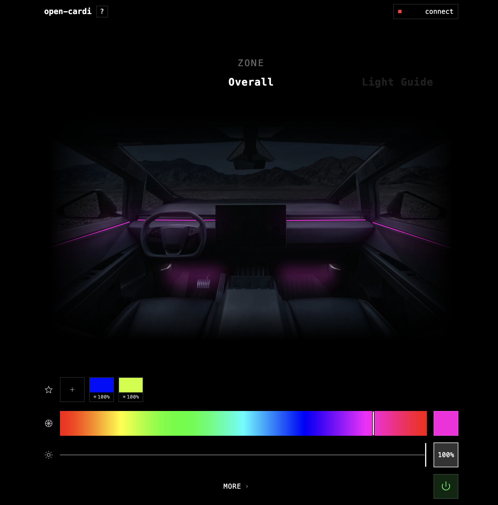

<div align="center">

  

  <h1>open-cardi</h1>

</div>

A beautiful web-app replacement for the **Cardi Tech** Android app ([`com.qc.xq`](https://play.google.com/store/apps/details?id=com.qc.xq)) — controls Cardi K3 / K4 Active Ultra (and other ConSmart-family) RGB ambient lighting kits from any Chromium browser. open-cardi reverse-engineers the same BLE protocol — no Android, no ads, no tracking.



- Website: **[opencardi.vercel.app](https://opencardi.vercel.app)**
- Writeup: [Reverse-engineering the Cardi Tech BLE protocol](https://harsh.ink/blog/reverse-engineering-cardi-tech)

## How it works

The kit's MCU is a Beken BK343x exposing a single GATT service (`0xFFF0`) with a write characteristic (`0xFFE2`, write-without-response) and a notify characteristic (`0xFFE1`). All commands are short framed packets — most are 6 bytes `ED <op> <a> <b> <c> E9`, plus a few odd ones (`FE _ EF` for zone select, `30 _ 03` for speed, `FA _ AF` for app mode).

Decoded ops (from APK decompile + HCI snoop replay):

| op | wire | use |
|---|---|---|
| color | `ED 49 R G B E9` | RGB × brightness, pre-multiplied client-side |
| master on / off | `ED F0 …` / `ED 0F …` | global kill switch |
| zone select | `FE z EF` | scopes the next color/pattern to one zone (1..8) |
| pattern | `ED <Mods[i]> 00 00 00 E9` | 23 presets, opcodes table-driven from `Mods[]` |
| speed | `30 s 03` | 1..100, applies to current pattern |
| mic | `ED 34 m m m E9` / `ED 33 …` | 4 reactive modes (Classic / Soft / Jump / Dance) |
| app mode | `FA 01/02 AF` | Classic vs Starlight rendering on the MCU |

The `CardiClient` (`src/lib/ble/client.ts`) does a tiny handshake replay on connect, then everything else is fire-and-forget writes — no ACKs, no flow control. State is mirrored locally so reconnects can re-apply the last snapshot.

K3 only has 2 effective zones (front-strip + footwell); K4 exposes 8. The UI hides K4-only zones behind a toggle.

## Stack

SvelteKit 5 (runes) · TypeScript · Tailwind v4 · Bun · Web Bluetooth · `navigator.bluetooth.requestDevice` filtered by service `0xFFF0` + name prefixes (`CarDiLits`, `iLits`, `BaoYin`, …). Served as a PWA so it installs on Android home screen; iOS needs [Bluefy](https://apps.apple.com/us/app/bluefy-web-ble-browser/id1492822055) because Safari has no Web Bluetooth.

## Supported device families

By BLE name prefix (all share the ConSmart-family firmware on service `0xFFF0`):

`CarDiLits` · `iLits` · `BaoYin` · `CaChuang` · `CarL` · `MTF-LIGHT` · `AIKON-LIT` · `Dream` · `Flash`

Tested end-to-end on Cardi K3 / K4 Active Ultra. If your kit advertises a different prefix, see **Debug** below.

## Develop

```sh
bun install
bun run dev
```

## Debug

A standalone Python REPL (`debug/open-cardi.py`, Bleak) lets you talk to the kit without the web app — useful for poking unknown ops, adding a new device prefix, or verifying captures. Quick start:

```sh
uv run debug/open-cardi.py scan    # find the device
uv run debug/open-cardi.py repl    # interactive prompt
```

See [`debug/README.md`](debug/README.md) for the full command reference and the workflow for onboarding a new device family. For the deeper reverse-engineering walkthrough (HCI snoop capture, APK decompile with jadx, protocol replay), see the [writeup](https://harsh.ink/blog/reverse-engineering-cardi-tech).

## License

[MIT](LICENSE).
